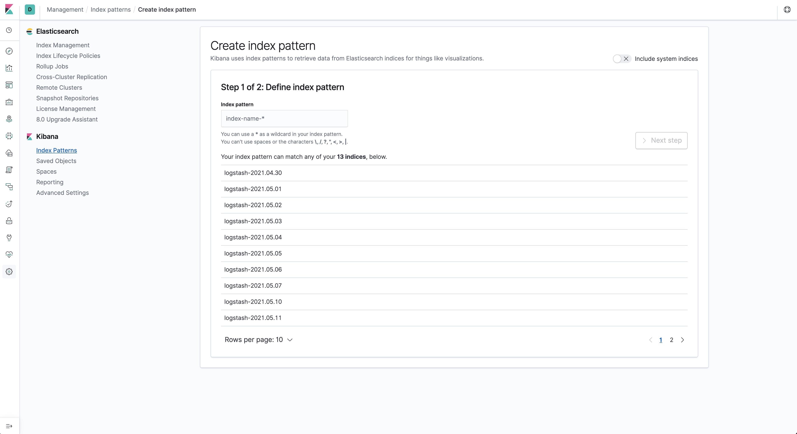
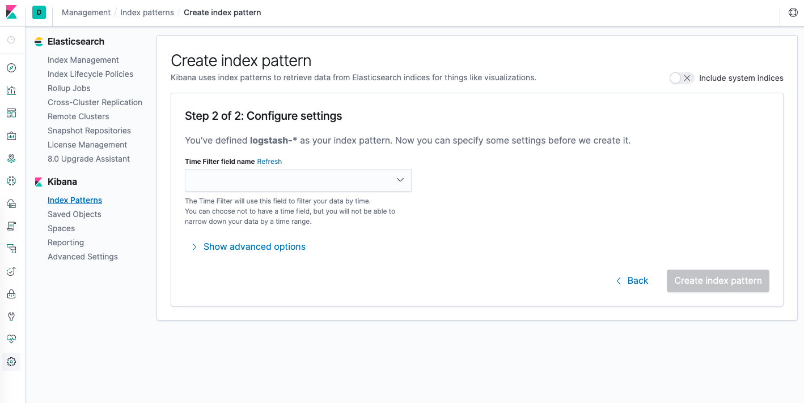
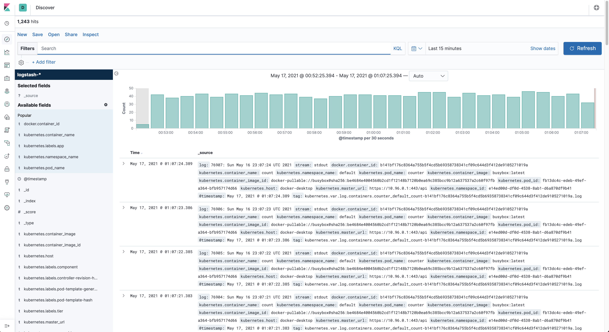
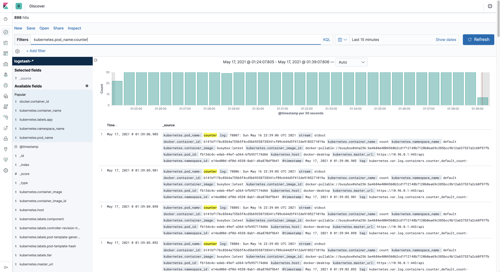

# Kubernetes Cluster Logging with EFK
This project has been created to demo cluster logging with EFK using Docker Desktop. Enabling Kubernetes support on 
Docker Desktop gives us an alternative to Minikube and Kind. The installation is quite simple, and you can have your
cluster running in seconds. According to a Docker.com [blog](https://www.docker.com/blog/kubernetes-is-now-available-in-docker-desktop-stable-channel/) 
Kubernetes support was added to Docker Desktop around 25 July 2018.

The Kubernetes cluster that runs within Docker Desktop is a single-node cluster and is primarily used for testing purposes.
This is great as it allows you to experiment with the technology faster as there are no costs like when running a
cluster in the cloud. Furthermore, you don't have to install any other tools like virtualbox to get up-and-running.

Docker Desktop with Kubernetes support is available for:
* Windows 10 (Professional or Enterprise)
* Mac OS (Sierra 10.12 minimum)

Before starting, let's have a look at what we will be creating.
<paste image>

## Enable Kubernetes Support
The following page https://docs.docker.com/desktop/kubernetes/ contains information on how to enable Kubernetes on
Docker Desktop. Follow the instructions to get started. Keep in mind that if you have installed `kubectl` and are using it
for other projects it could be that it is pointing to another context. If that's the case then you must make sure it is
pointing to the `docker-desktop` context, otherwise you will have issues connecting to your local Kubernetes cluster.

## Simplify life with Kubectl Autocomplete
Working with kubectl to create resources is quite easy, just apply a YAML file, and your good to go. Actually `kubectl` has 
a lot more to offer. You will eventually need to know if your deployment is successful, read the running configuration of 
a resource, etc. Typing all those commands could become quite a chore, so thankfully we got autocompletion.

If you're running a ZSH terminal this is quite simple to set up, all you need to do is add the following to the beginning 
of `~/.zshrc`:
```shell
autoload -Uz compinit
compinit
source <(kubectl completion zsh)
```
Information on the ZSH configuration can be found [here](https://kubernetes.io/docs/tasks/tools/included/optional-kubectl-configs-zsh/).
The folks at Kubernetes.io have also provided us with a [Kubectl cheatsheet](https://kubernetes.io/docs/reference/kubectl/cheatsheet/).

## Verify Single-Node Kubernetes cluster is up
Once Kubernetes is enabled, we can start interacting with it using `kubectl`.

Let's check how many nodes our cluster has. The result should contain 1 (single-node cluster): 
```shell
$ kubectl get nodes
```
To get information about our cluster:
```shell
$ kubectl describe node docker-desktop
```
Or
```shell
$ kubectl cluster-info
```

## Creating the cluster namespace
A Kubernetes cluster comes with a set of predefines namespaces (i.e. kube-system, kube-public...) containing resources 
to function properly. Namespaces are a way to divide cluster resources between multiple users. It is not required to 
create namespaces when working on a small project, but it helps to create some structure.

To view the current active namespaces: 
```shell
$ kubectl get namespaces
```
Now that we have seen the list, let us start by creating our first own namespace:
```shell
$ kubectl apply -f 1-efk-logging-ns.yaml
```
Let us confirm the namespace is created:
```shell
$ kubectl get namespaces
```

If everything looks as expected we can than continue with the creation of our Elasticsearch cluster.

## Creating the Elasticsearch cluster
We will be creating a 3-node Elasticsearch cluster in this section. Why a 3-node cluster you may ask? It's a best practice, 
and prevents the "split-brain" situation in a highly available multi-node cluster. In short, "split-brain" arises when one or more
nodes can't communicate with each other (i.e. node failure, network disconnect, etc) and a new master can't be elected. 
With a 3-node cluster if one of the nodes get disconnected then by election a new master can be assigned from the
remaining nodes.

For more information read [Designing for resilience](https://www.elastic.co/guide/en/elasticsearch/reference/current/high-availability-cluster-design.html).

### Headless Service
Before we create our 3-node Elasticsearch cluster, we will need to create a Kubernetes headless service. This headless
service will not act as a loadbalancer and will not return a single IP address. Instead, it will return all the IP's 
of the associated Pod's. Headless Services do not have a ClusterIP allocated, will not be proxied by kube-proxy but in this
case it will allow Elasticsearch to handle service discovery. We achieve this by setting the `ClusterIP` configuration to `None`.

Create the headless service:
```shell
$ kubectl apply -f 2-elasticsearch-svc.yaml
```
Read [Headless Services & Service Types](https://kubernetes.io/docs/concepts/services-networking/service/#headless-services) for more
information.

### Elasticsearch StatefulSet
Rolling out the 3-node Elasticsearch cluster in Kubernetes requires a different type of resource also known as the
StatefulSet. It provides pods with a stable identity and grants them stable persistent storage. Elasticsearch requires 
stable persistent storage to persist data between Pod rescheduling and restarts. To learn more about 
[StatefulSets](https://kubernetes.io/docs/concepts/workloads/controllers/statefulset/) visit the kubernetes.io website.

To create the Elasticsearch StatefulSet:
```shell
$ kubectl apply -f 3-elasticsearch-sts.yaml
```
We can follow the creation by running the following command: 
```shell
$ kubectl rollout status sts/es-cluster -n efk-logging
```
We should also be able to see all elasticsearch pods running in the provided namespace:
```shell
$ kubectl get pods -n efk-logging
```

Prior to the StatefulSet installation we talked about a headless service not returning a single IP address. We can verify
this by running a special Pod with DNS utilities, and run a command to perform a service lookup to obtain all the Pod IP 
addresses backing the headless service:
```shell
# install & run the DNSUtils Pod in the correct namespace, so that it has access to the headless service!
$ kubectl run dnsutils --image=tutum/dnsutils -n efk-logging -- sleep infinity
# run nslookup command against the elasticsearch service, should return multiple IP's
$ kubectl exec dnsutils -n efk-logging -- nslookup elasticsearch
```
The endpoint resource can also provide us with IP address information:
```shell
# checking the service endpoints
$ kubectl get endpoints elasticsearch -n efk-logging
# or running describe to get the complete output of the service endpoints
$ kubectl describe endpoints elasticsearch -n efk-logging
```
Not only will Kubernetes assign each Service/Pod with its own IP address it also adds DNS records. This makes it easier
for clients to find those services instead of using IP addresses. Go to kubernetes.io to learn more about
[Kubernetes DNS](https://kubernetes.io/docs/concepts/services-networking/dns-pod-service/).

Using the same DNSUtils Pod we can extract DNS information by running a nslookup on one of the Elasticsearch Pods:
```shell
# returns the FQDN for the pod, remember to run nslookup first on the headless service
$ kubectl exec dnsutils -n kube-logging -- nslookup <pod-ip-address>
```
The result should follow a pattern that looks like this: `{pod-name}.{service-name}.{namespace}.svc.cluster.local`. In our
case it should resemble the following values: `es-cluster-[0,1,2].elasticsearch.efk-logging.svc.cluster.local`. Running
the StatefulSet with multiple replicas creates Pods with the supplied name followed by an ordinal number, as can be seen
in the DNS entries. Kubernetes also uses this number when doing RollingUpdates as it will start with the highest number 
and ending with 0.

### Elasticsearch cluster REST-API
Now that our Elasticsearch cluster is running we can access its REST API and verify everything is running as expected. Doing
so allows us to see how our running cluster configuration looks like and what the health state is. To make this REST API 
available we made `port 9200` available while creating the headless service. Since we cannot access the REST API service
directly we will `port-forward` it and make it available outside the cluster.

Port-forwarding is as easy as running one single command:
```shell
$ kubectl port-forward es-cluster-0 -n efk-logging 9200:9200
```
Open a new Terminal window so that we can query the REST API interface:
```shell
$ curl -XGET 'localhost:9200/_cluster/health?pretty'
# we can also ask information about the running nodes on our cluster
$ curl -X GET "localhost:9200/_cluster/state/nodes?pretty"
```
To get some cluster topology in view, run:
```shell
# the result contains IP addresses, roles and metrics
curl -X GET "localhost:9200/_cat/nodes?v"
```
We should see node- IP addresses, metrics, roles and current master node. See
`cat nodes` from [CAT API](https://www.elastic.co/guide/en/elasticsearch/reference/7.x/cat-nodes.html) and customize the 
output by adding headers to the request.

The above examples only touch the `Cluster API/CAT API` but there are more, 
go to [REST API](https://www.elastic.co/guide/en/elasticsearch/reference/7.x/rest-apis.html) for more information.

## Creating the Service & Kibana Deployment
In this section we will create the Kibana Service and Deployment resources and execute them to have a running Kibana 
instance. Kibana will then provide us with the centralized interface where we can analyze application logs. 

We will rollout a single Kibana instance:
```shell
$ kubectl apply -f 4-kibana.yaml
```
Verify rollout is succesful:
```shell
$ kubectl rollout status deployment/kibana -n efk-logging
```
Kibana should now be running on the Kubernetes cluster, and to be able to access the dashboard we will also need to 
apply port-forwarding.

```shell
# first we must retrieve the node name
$ kubectl get nodes -n efk-logging
# copy-past the kibana-{id} node name in the following command
$ kubeceltl port-forward <kibana-node> -n efk-logging 5601:5601
```
Open a browser and go to <http://localhost:5601>, you should see Kibana loading up. Don't do anything further at
this point. We will configure an index later.

## Creating the FluentD DeamonSet
In this final step we will start rolling out the FluentD log collector. We will do this by introducing, yet again, a new 
resource type, the DeamonSet. Kubernetes will roll out a copy of this Pod(node-logging agent) on each node in the Kubernetes 
cluster. The idea behind this solution is that the logging-agent running as a container in a Pod will have access to
a directory with log files from all the application containers on that Kubernetes node. All running containers will write
stdout and stderr with no agreed format. The logging-agent collect these logs and forward them to the aggregator.

For other approaches read [Cluster-level logging](https://kubernetes.io/docs/concepts/cluster-administration/logging/#using-a-node-logging-agent).

To roll out the FluentD DeamonSet, run the following command:
```shell
$ kubectl apply -f 5-fluentd.yaml
```
Looking at the FluentD DeamonSet configuration we just rolled out, you'll see that other resource types were needed, like 
the ServiceAccount, ClusterRole and ClusterRoleBinding. All these resources are needed to cover the following:
* ServiceAccount: Provides FluentD with access to the Kubernetes-API
* ClusterRole: Grants permissions (get, list and watch) on the Pods and Namespaces. In other words grants access to other
cluster-scoped Kubernetes resources like Nodes
* ClusterRoleBinding: Binds ServiceAccount to the ClusterRole. Grants ServiceAccount permissions listed in the ClusterRole

Let's verify the DeamonSet was rolled out successfully:
```shell
# should return 1 FluentD instance
$ kubectl get ds -n efk-logging
```

## Analyze logs with Kibana
Now it's time to verify log data is collected properly and shipped to Elasticsearch. Before doing so we must
first define an index pattern we would like to explore in Kibana. Simply put an index in Elasticsearch is a collection
of related JSON documents. FluentD provides us with those JSON documents and enriches it with Kubernetes fields we can
use.

In Kibana we need to click on the `Discover` icon on the left-hand navigation, this starts the Index creation process.

If you take closer a look at the image above (taken days later running the cluster), you will see some available indices. 
You can then match your index pattern based on that, and in our case that would be `logstash-*`.

In the second and last step we need to define the filter time field Kibana will use to filter log data. Choose `@timestamp`
from the drop-down and click on the `Create index pattern` button.


Click the `Discover` button again, the output should resemble something like this after running some time.


Read the [Kibana Guide](https://www.elastic.co/guide/en/kibana/current/index.html) to learn more about Kibana, includes 
a Quick Start section and other useful information like, how to create dashboards to visualize your log data.

Final step complete! The 3-node Elasticsearch cluster is up and running and integrated with FluentD to capture log data.
We've also configured Kibana with Elasticsearch, so that we can start analyzing/visualizing log data.

## Launch Counter Pods & analyze log data
The real final piece in this setup is capturing our application data. Therefore, we will deploy a small application to 
generate some log data for us to see.

Deploy the counter application to Kubernetes:
```shell
$ kubectl apply -f 6-counter-en.yaml
```
The application should now be generating log data every 5 seconds. To view that data you must click on the `Discover` menu
item and enter the following `kubernetes.pod_name:counter` in the filter field.


We can now launch multiple applications or scale them and FluentD will be responsible for gathering all the log data
for us. Let's launch one more counter Pod that sends information in another language at another time frequency.
```shell
$ kubectl apply -f 7-counter-en.yaml
```
Go to Kinbana and click on the `Refresh` button to reload the data. To make the information a bit more readable we select
fields: `kubernetes.pod_name` and `log` from the available fields. Modify the filter query to `kubernetes.pod_name:counter*`
to retrieve log data from both running pods. The result should look something like this:


## The END
This rounds up Kubernetes Cluster logging with EFK. You have just witnessed how easy it is to get up-and-running with Kubernetes
on your local machine. The deployment of different resources is straight forward and all you have to do is run several
`kubectl` commands to verify everything is running smoothly. We deployed a complete EFK stack on this single-node Kubernetes
cluster and were able to analyze logs coming from different applications. 

I encourage you to try it out if you haven't and start playing with Kubernetes. When you're done playing around, you 
can destroy/reset the whole Kubernetes cluster and start all over again.
